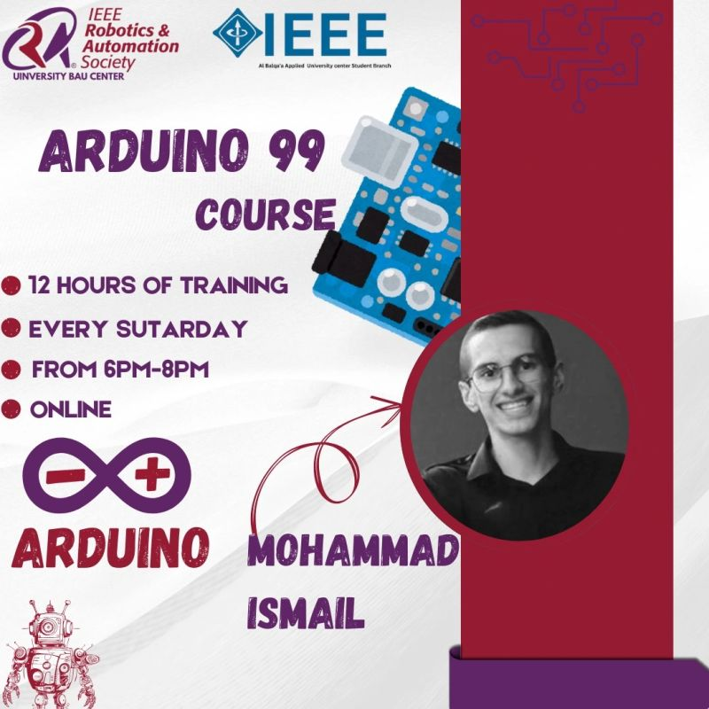

# Arduino 99 — IEEE RAS Workshops



A hands-on Arduino training series delivered under **IEEE Robotics & Automation Society (RAS)** — University BAU Center — led by **Mohammad Ismail**.  
**Audience:** 500+ participants from across the Middle East.  
**Format:** Online · **12 hours** total · **Every Saturday 6–8 PM**.

---

## 📚 Course Overview
- Learn Arduino from zero to strong foundations through **six workshops**.
- Each session includes **live demos**, **practice sketches**, and **home exercises**.
- Final session builds a **simple mobile robot** as a capstone.

> **Recorded sessions:** https://drive.google.com/drive/folders/15nEn1KmiMwyX1cmH0K3ZoFhjJg331kHN?usp=sharing

---

## 🧭 Course Structure


Folders in this repo:
```
RAS 1st workshop/
RAS 2ed workshop/
RAS 3ed workshop/
RAS 4th workshop/
RAS 5th workshop (by Jullnar Radwan)/
RAS 6th workshop/
course plan.txt
recorded videos.txt
RAS.jpg
```
> *Tip:* Keep code examples and slides for each workshop inside the corresponding folder.

---

## 🗓️ Workshops & Topics

### 1) First Workshop — Foundations
- Arduino anatomy & definition, Arduino IDE  
- Program flow: `void setup()` / `void loop()`  
- GPIO basics: `pinMode()`, `digitalWrite()`, `digitalRead()`, `analogWrite()` (PWM), `analogRead()`  
- Breadboard basics, Blink (LED)  
- Serial: `Serial.begin()`, `Serial.print()`, `Serial.available()`, `Serial.read()`, `Serial.write()`

### 2) Second Workshop — Inputs, Functions & Analog I/O
- RGB control with `analogWrite()` and custom functions  
- Pushbutton integration using `digitalRead()`  
- Analog inputs & `analogRead()`  
- **LM35** temperature sensor example  
- Potentiometer & `map()`

### 3) Third Workshop — Sensors & Interfaces
- Ultrasonic sensor (distance)  
- Buzzer / Piezo with `tone()` and `noTone()`  
- PIR motion sensor  
- 16×2 LCD (parallel or I²C)  
- Analog joystick

### 4) Fourth Workshop — Actuators & Systems
- DC motor drivers: **L298N**, **L293D**  
- Keypad (with library)  
- Servo motor  
- Password-based security door lock system

### 5) Fifth Workshop — Electronics Fundamentals (by Jullnar Radwan)
- Core circuit concepts to make your Arduino projects robust

### 6) Sixth Workshop — Final Project
- Build and test a **simple mobile robot** (integration of sensors, drivers, and logic)

---

## 🧰 What You Need
- **Arduino UNO** (or compatible) + USB cable  
- **Breadboard**, jumpers, LEDs, resistors  
- Sensors: Ultrasonic, PIR, LM35, Joystick, 16×2 LCD (with/without I²C)  
- Actuators & drivers: Servo, DC motors, **L298N/L293D**  
- **Arduino IDE** (latest)  

> Each workshop folder will reference the exact components used.

---

## 🚀 Getting Started
1. Install the **Arduino IDE**.  
2. Open the workshop folder you’re following.  
3. Load the `.ino` example, select the correct **Board** and **Port**, then **Upload**.  
4. Use **Serial Monitor** where indicated by the sketch.

---

## 🤝 Contributing
- Found an issue or have an improvement? Open a **Pull Request**.  
- Add your demo videos, improved circuit diagrams, or code comments.

---

## 📬 Contact
- Instructor: **Mohammad Ismail**  
- Chapter: **IEEE RAS — University BAU Center**
- Special thanks to **Jullnar Radwan** for the electronics fundamentals session.

---

